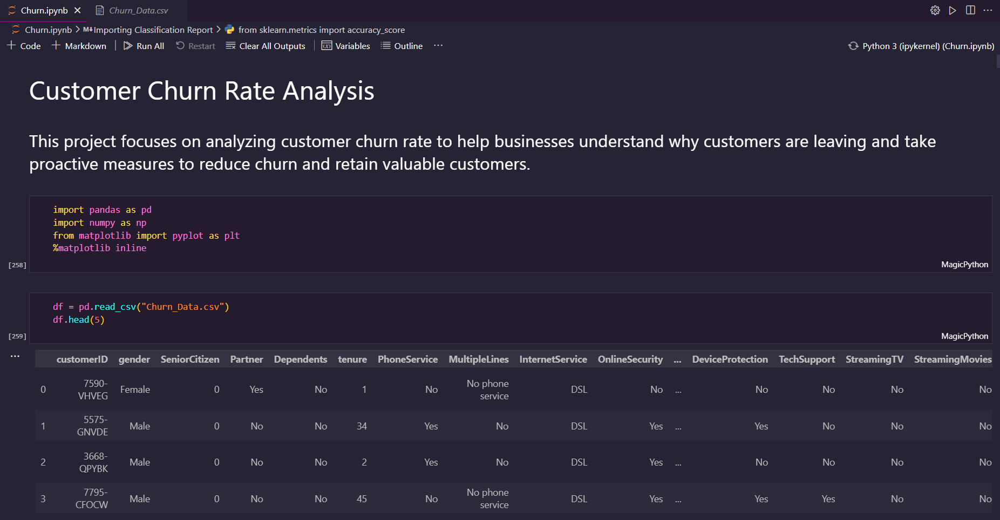
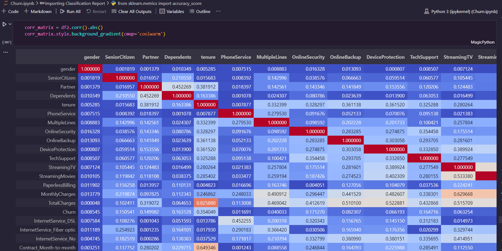

## Customer Churn Rate Analysis

## 📌 Problem Definition

Given a dataset containing information about `7,043 customers` from a Telecommunications company in California in Q2 2022, our task is to predict whether each customer will churn, stay, or join the company.

The dataset includes details such as `tenure`, `subscription services`, and the `customer's status` for the quarter.

Additionally, we have access to a Zip Code Population table that provides estimated population information for the California zip codes in the Customer Churn dataset.
  

## 👀 Screenshots

 

## 👉 Application

The ability to predict customer churn in advance enables businesses to take proactive measures to prevent customers from leaving. This can be achieved through various actions, such as:

**1. Customer Retention Strategies:** By identifying high-risk customers who are likely to churn, customer success teams can reach out to them and provide personalized support. This could involve addressing their concerns, resolving issues, or offering incentives to encourage them to stay.

**2. Improving Customer Experience:** Churn prediction can highlight areas where the business can improve its services or products. By analyzing the factors that contribute to churn, businesses can make necessary improvements to enhance customer satisfaction and loyalty.

**3. Targeted Marketing Campaigns:** Churn prediction models can help businesses identify specific customer segments that are more prone to churn. By understanding the characteristics and behaviors of these segments, targeted marketing campaigns can be designed to re-engage and retain these customers.

**4. Upselling and Cross-selling Opportunities:** Churn prediction can also uncover opportunities for upselling or cross-selling to existing customers. By identifying customers who are likely to stay but may be interested in additional products or services, businesses can tailor their offers to maximize revenue and customer retention.

Overall, predicting customer churn allows businesses to proactively address customer needs, improve their services, and implement effective retention strategies, ultimately leading to higher customer satisfaction and long-term business success.
 

## ✍️ Authors

- [Abhiram Laha](https://github.com/Abhiram-Laha)

 
