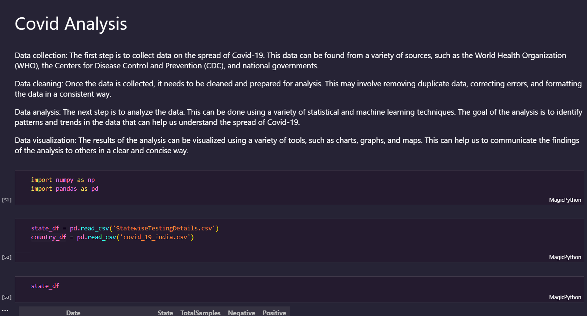
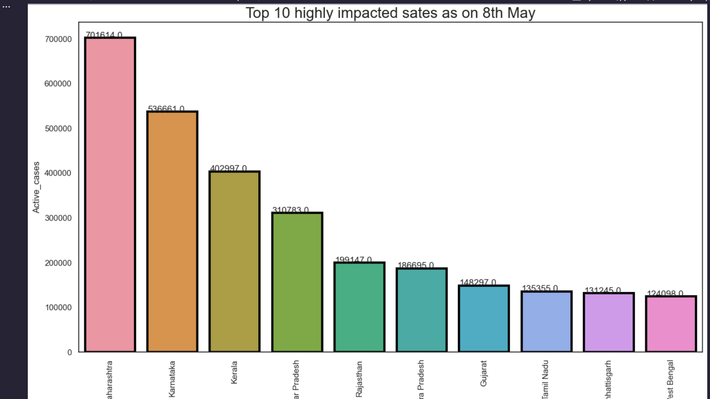
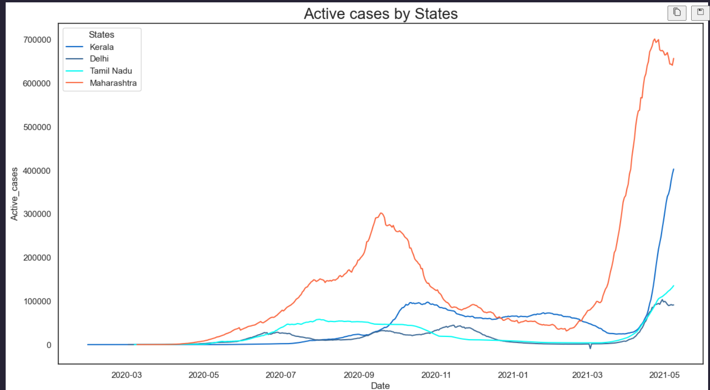
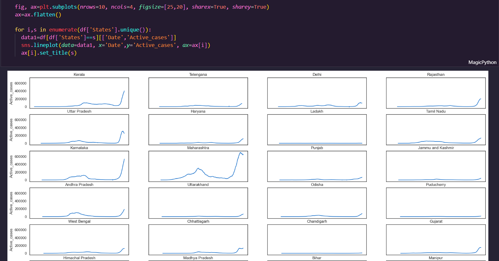
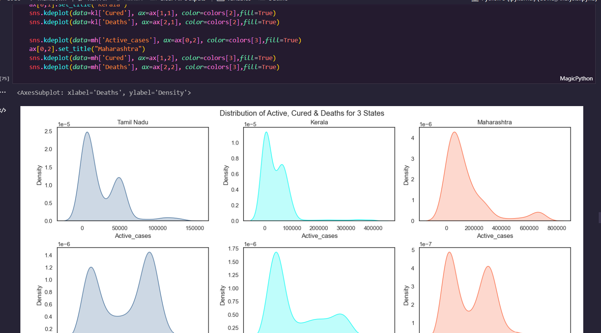

## Covid Analysis

## 📌 Problem Definition

COVID-19 cases at daily level is present in `covid_19_india.csv file`

Statewise testing details in `StatewiseTestingDetails.csv` file

To analyze the COVID-19 data in India and determine the cure, death and active cases rates in all States.
Plotting the active cases in states as on end date i.e. 8th May 2021
  

## 👀 Screenshots

 

## ✍️ Authors

- [Abhiram Laha](https://github.com/Abhiram-Laha)

 
